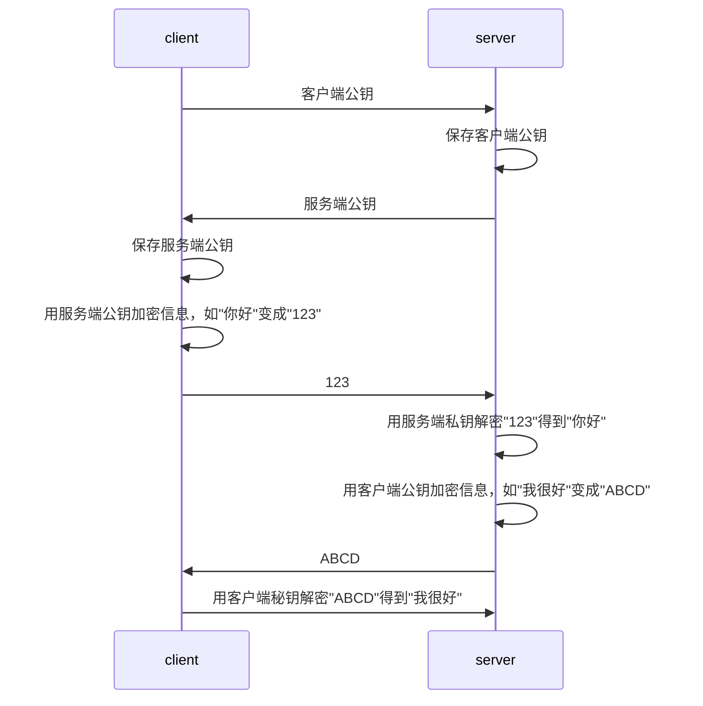

# 是什么？

ssh在维基百科上的解释。安全外壳协议（**Secure Shell Protocol**，简称SSH）是一种**加密的网络传输协议**，可在不安全的网络中为网络服务提供安全的传输环境。 SSH通过在网络中建立安全隧道来实现SSH客户端与服务器之间的连接。 SSH最常见的**用途是远程登录系统**，人们通常利用SSH来传输命令行界面和远程执行命令。

[什么是ssh？](https://info.support.huawei.com/info-finder/encyclopedia/zh/SSH.html)它是如何工作的，详细可以看这个文章。

# 协议流程

## 流程图

先理解一个点，ssh是非对称加密，如果要支持双工通道，则客户端和服务端都需要持有对方的公钥。那么很容易就得到下面这张图。

## 密钥交换

上图忽略了如何交换双方公钥，
