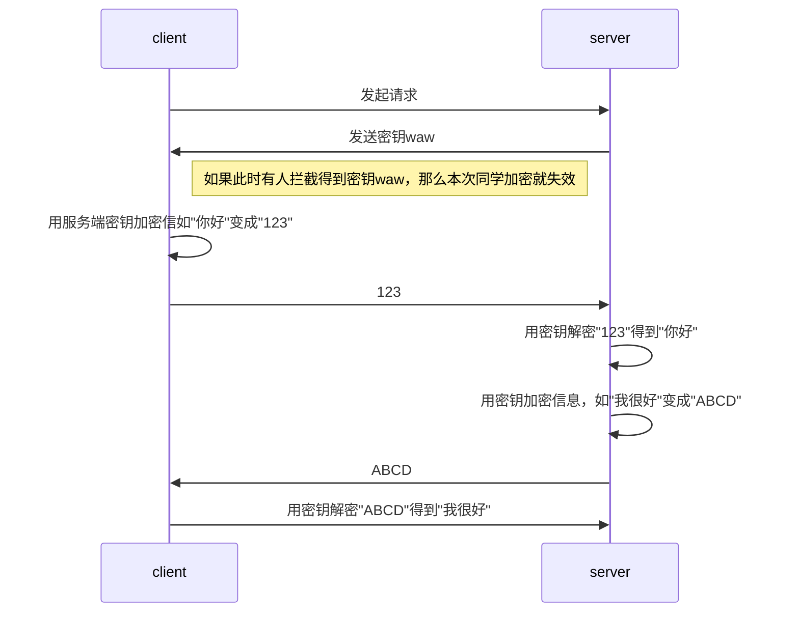
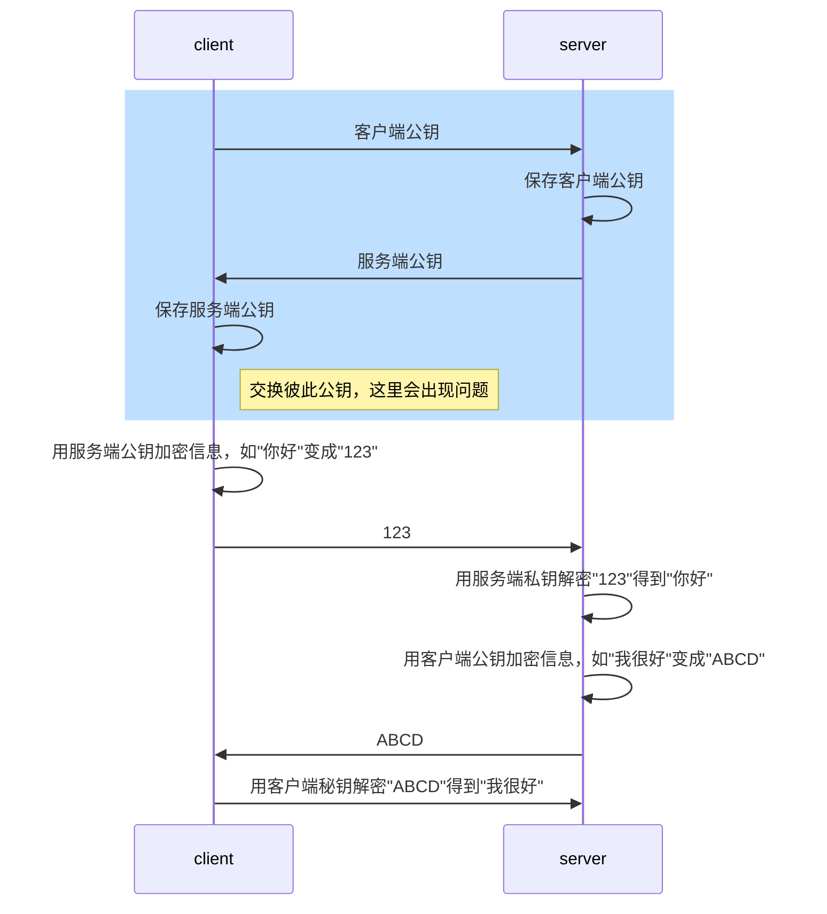

# 加密方式

* 对称加密：加密的码和解密的码一样，容易泄漏
* 非对称加密：加密的码和解密的码不一样，加密码称为公钥，解密码称为私钥。这样信息发送按照公钥加密，只有信息接收方有私钥解密，其他没有私钥的人都无法破解。

# 能否用对称加密？

使用对称加密，有一个前置要求：密钥双方都要知道，也就是要协商好。在互联网场景下，用户的客户端和服务器无法一对一协商，只能在用户需要访问的时候，由服务器传给客户端（或者客户端传给服务器）。密钥在互联网的传输过程中，如果被人拦截，那么密钥泄漏，也就失去了加密的意义，这就是叫**中间人攻击**。这个问题答案是不能。

既然中间人攻击的原因就是密钥直接在网络中传输导致的泄漏，有没有可能不传输密钥？有一个办法，就是所有客户端/浏览器都记下所有网站的密钥，这显然是不现实的。

基于上面说的原因，在互联网上只对称加密是有安全风险的。

# 能否用一对非对称加密？

不能，因为双工通信，双方都需要加密，同理双方都需要解密。所以需要两对非对称加密密钥。

# 能否对所有客户端使用一对密钥？

不能，如果所有客户端用一个公钥加密，那么所有用户用相同私钥就能解密。也就是不同客户端可以看到彼此服务端发送的消息。客户端对所有服务端能否使用一对密钥？回答同样如此。

# 现在非现实的非对称加密流程

这个是双向数据加密，都采用对方公钥加密。如果在交换公钥过程中，被中间人窃取，给client和server都发送成中间人的公钥，那么后续中间人就能解密两端的所有信息。所以引出一个问题，如何防止公钥的被篡改？（一般都不用交换彼此公钥的做法，因为要防止两次公钥被篡改）。

# 如何防止公钥被篡改？
